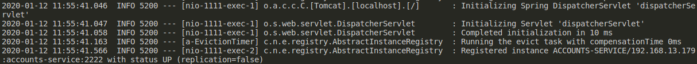

# lab6-microservices

Author: Andrew Mackay  
NIP: 737069  
Date: 12/01/2020

## 1. Launch of Eureka Service Registration Server

First, we launch Eureka's registration server on port 1111. The log output is:

 

 Now, we can access the server on port 1111 to check the services registered.
 Since we have only launched the register service, there will be no services
 registered:

## 2. Launching the Accounts Service

The next step is to launch the accounts service on port 2222 on a new terminal. 
The log output is:

If we check the log output of the registration service, we can check that the
accounts service has been detected and registered:

The Eureka server now displays the new registered service:

We can also access the port 2222 on our browser and observe that the accounts
service is running:

## 3. Launching the Web Service

In a similar way to the accounts service, the web service is launched on port
3333 on a new terminal:

Once it's launched, the log output of the Eureka registration service displays:

The Eureka server now displays the new registered service and the accounts
service:

And if we access the port 3333 on our browser, we can check that the web service
is up and running:

## 4. Launching the Second Accounts Service

To launch a second accounts services, first we have to modify the server's port
value in the service's application.yml file from 2222 to 4444. Then, we can
launch it in exactly the same way as the first accounts service, on a new 
terminal:

Once it's launched, the Eureka registration service outputs:

The Eureka server will now display 2 types of services, but the accounts
service line will have 2 instances:

## 5. Killing the First Accounts Service

If we kill the first accounts service, the Eureka server displays the service
as *down*, and then it dissappears and only shows 2 services like before.

At the same time, the log output of the registration service is:

Because there is another accounts service registered on port 4444, the application
continues working since they both have access to the same database. We can check
that a account details web page is still accesible from the web server:

